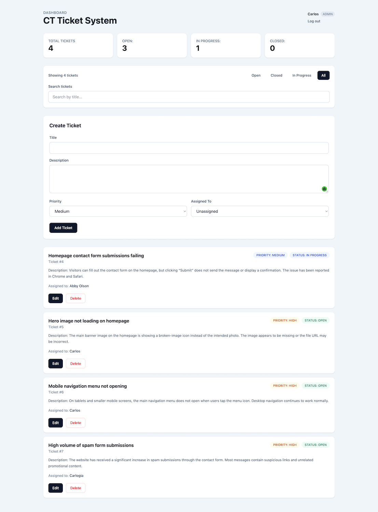
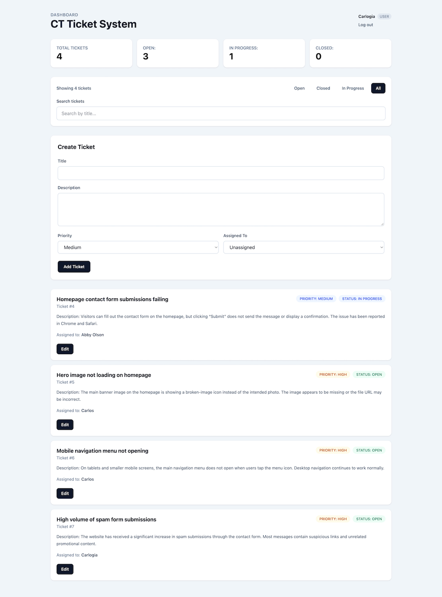
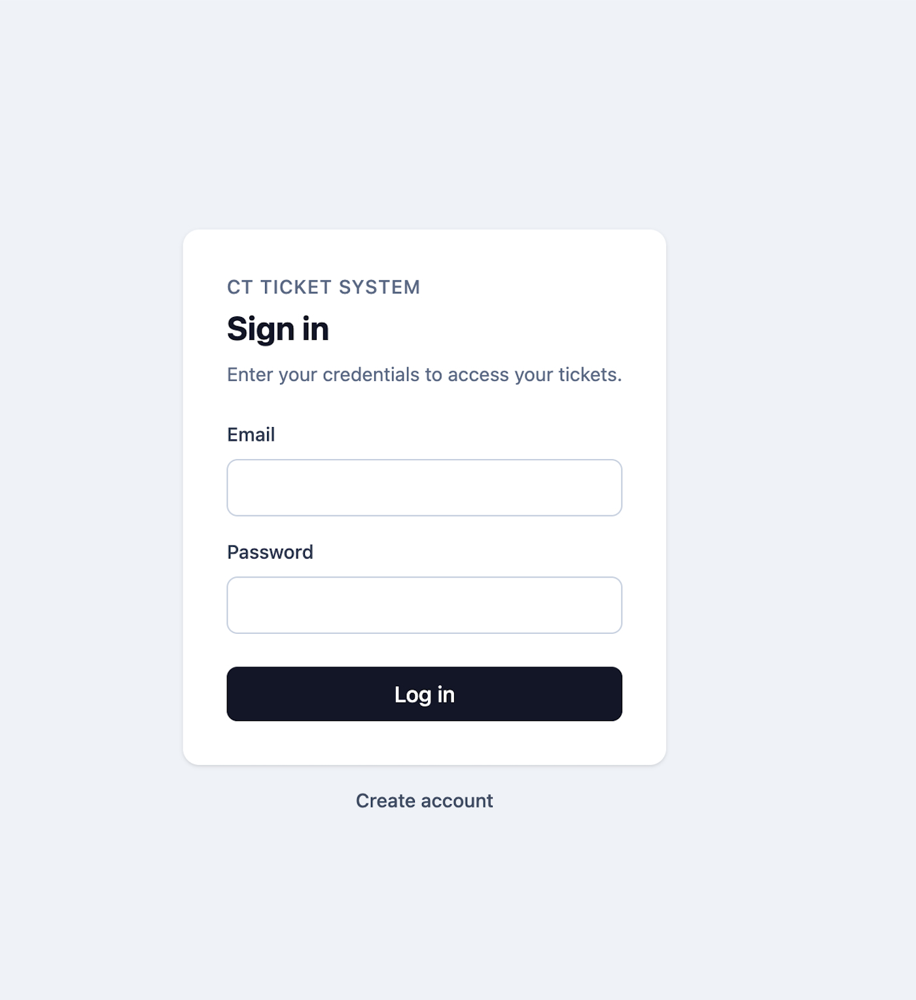

# CT Ticket System

A full-stack ticket management application built with React, TypeScript, Node.js, Express, and PostgreSQL, with authentication, role-based authorization, containerized deployment to Microsoft Azure, and automated CI/CD through GitHub Actions.

CT Ticket System provides authenticated users with a workflow for creating, managing, assigning, searching, filtering, and updating support tickets, with administrative permissions for protected operations.

## Live Application

**Frontend:**
https://tickets.carlogia.com/

**Production API:**
https://api.carlogia.com/

The application is deployed to Microsoft Azure, with the React frontend hosted on Azure Static Web Apps and the containerized Express API running on Azure Container Apps.

## Application Preview

### Admin Dashboard



The administrator dashboard provides ticket metrics, search and status filtering, ticket creation and assignment, priority and status tracking, and administrative controls for editing and deleting tickets.

### Role-Based Access



Standard users can create and edit tickets but do not receive administrator-only deletion controls. Authorization for protected operations is enforced by the backend API.

### Authentication



CT Ticket System uses session-based authentication with PostgreSQL-backed persistent sessions.


## Current Version

### v1.0 — Full-Stack Cloud Deployment

CT Ticket System is deployed as a full client/server/database application.

The React and TypeScript frontend is hosted on Azure Static Web Apps. The Node.js and Express REST API is packaged as a Docker container and deployed to Azure Container Apps, with PostgreSQL providing persistent application, user, and session data.

Backend deployments are automated through GitHub Actions. Changes pushed to the `master` branch are tested with Vitest, authenticated to Azure using OpenID Connect (OIDC), packaged into a Docker image, pushed to Azure Container Registry, and deployed to Azure Container Apps.

Docker images are tagged with the Git commit SHA, providing traceability between source code, GitHub Actions runs, container images, and production deployments.

## Key Features

- React application with TypeScript
- Node.js and Express REST API
- PostgreSQL persistent storage
- PostgreSQL connection pooling with `pg`
- User registration
- Password hashing with `bcrypt`
- Login and logout
- Session-based authentication
- PostgreSQL-backed persistent sessions
- Role-based authorization
- Admin and standard user roles
- Protected API routes
- Admin-only ticket deletion
- User-to-ticket assignments
- RESTful ticket endpoints
- PostgreSQL-generated ticket IDs
- PostgreSQL default ticket status
- Database constraints
- Parameterized SQL queries
- Server-side request validation
- Frontend API error handling
- Controlled form inputs
- Editable ticket status
- Form validation
- Status filtering
- Case-insensitive ticket search
- Combined search and status filtering
- Conditional rendering
- Derived state
- Immutable state updates
- Automated unit testing with Vitest

## Technology Stack

### Frontend

- React
- TypeScript
- Vite
- Fetch API
- HTML
- CSS

### Backend

- Node.js
- Express
- TypeScript
- REST API
- `bcrypt`
- Session-based authentication

### Database

- PostgreSQL
- `pg`
- Parameterized SQL
- PostgreSQL-backed session storage

### Testing

- Vitest
- Automated tests executed as part of the backend CI/CD pipeline

### Cloud & DevOps

- Docker
- Microsoft Azure
- Azure Static Web Apps
- Azure Container Apps
- Azure Container Registry
- GitHub Actions
- OpenID Connect (OIDC)
- Environment-based configuration
- Automated CI/CD

## Application Architecture

```text
                    USERS
                      │
                      ▼
              React + TypeScript
             Azure Static Web Apps
                      │
                 HTTPS / JSON
                  Fetch API
                      │
                      ▼
             Express + TypeScript
             Azure Container Apps
                      │
                Authentication
                Authorization
                  Validation
                   REST API
                      │
              Parameterized SQL
                      │
                      ▼
                  PostgreSQL
                      │
          ┌───────────┼───────────┐
          │           │           │
       Tickets       Users      Sessions